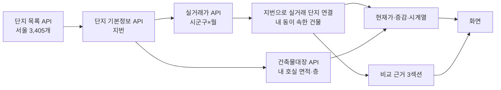
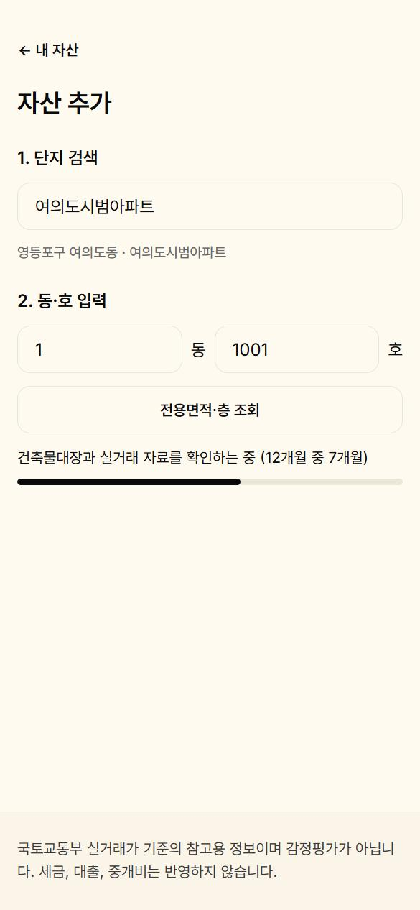
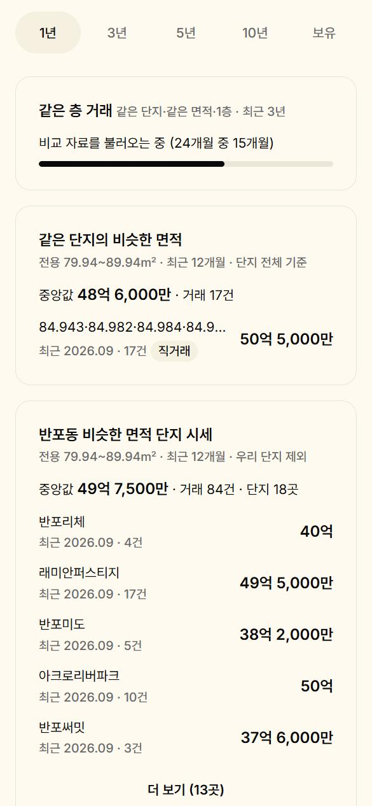
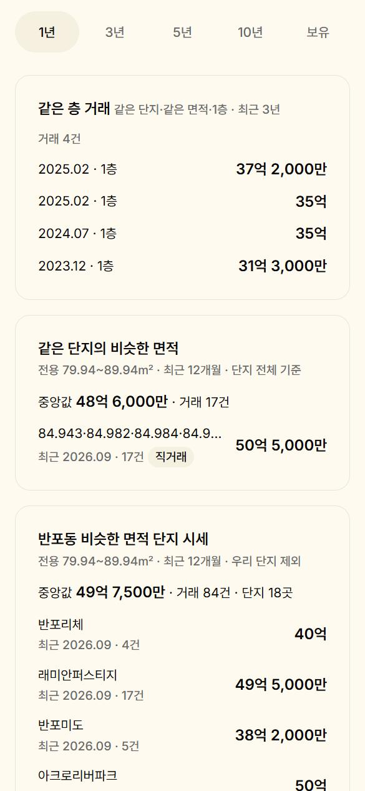

# 버틀러 자산 현황 대시보드 — 개발 완료 보고서

- 작성일: 2026-10-07
- 범위: PoC(M0~M6) + 개선 v2(비교 근거 3섹션, 재수집 12개월) + 실제 수집 경로 E2E 검증
- 저장소: https://github.com/kireal1017/butler-asset-dashboard-poc (`main`, 개선 v2 커밋 `05eefb9`)
- 세부 문서: [PoC 보고서](poc-report.md) · [개선 명세 v2.1](IMPROVEMENT-SPEC.md) · [E0 실측](e0-measure.md) · [검증 기록](verification.md) · [API 노트](api-notes.md) · [데이터 품질](data-quality.md) · [PRD](PRD.md)
- 화면: [`docs/screens/`](screens/) 30장 (390×844 모바일, 모두 실제 공공데이터)

---

## 1. 한눈에 보기

> 임대인이 단지와 동·호만 입력하면 국토교통부 실거래가로 **"내가 산 가격 대비 지금 가격"**을 보여 주고, 그 가격이 적정한지 판단할 **비교 근거 3가지**(같은 층·같은 단지·같은 동네)를 함께 보여 준다. 화면의 모든 숫자는 실제 공공데이터에서 나오며, 앱과 독립된 재계산으로 한 건도 틀리지 않았음을 확인했다.

| 항목 | 결과 |
|---|---|
| PoC 목표 3가지 | 달성 — 실제 호실 등록, 실데이터 시세·추이, 매입 거래 자동 매칭 |
| 개선 v2 | 비교 근거 3섹션 + 재수집 범위 3→12개월 |
| 데이터 | 공공데이터 API 4종, 서울 5개 구 실거래 **336개월·93,682건** (더미 0건) |
| 정확성 | 독립 재계산 **불일치 0** — 원본 행 93,682건, 시계열 28개, 비교 근거 21개 (자산 7개) |
| 회귀 | 개선 전후 코드를 같은 데이터로 나란히 실행: 서버 응답 58개·화면 값 72개 **차이 0** |
| E2E | 실제 API로 빠진 달 24개월 수집 → 화면 자동 갱신, 수집 결과가 기준 데이터와 **6,022건 완전 일치** |
| 테스트 | 자동 테스트 **131개** 통과 (서버 114, 화면 17) |
| 품질 | 리뷰·화면 점검으로 결함 **19건** 발견 후 수정 (PoC 15, 개선 v2 4) |
| 화면 | 390px 가로 넘침 0, 콘솔 오류 0, 모든 화면 하단 고지 유지 |

---

## 2. 무엇을 만들었나

### 2.1 기능
| 영역 | 기능 | 화면 |
|---|---|---|
| 자산 등록 | 단지 검색 → 동·호 → 건축물대장에서 전용면적·층 자동 조회(없으면 실거래 면적에서 선택) | 03~05, 30 |
| 매입 거래 | 취득 연월 앞 3개월의 같은 단지·면적·층 실거래를 후보로 제시, 확정 또는 직접 입력 | 06~08 |
| 홈 | 자산별 현재가와 매입가(또는 직전 거래) 대비 증감 | 01, 02 |
| 상세 | 현재가·증감, 기간 탭(1·3·5·10년·보유), 그래프 3종(계단·선·막대), 매입 거래, 최근 거래, 건물 정보 | 09~17 |
| **비교 근거 (v2)** | 같은 층 거래(3년, 없으면 ±2층) · 같은 단지의 비슷한 면적(단지 전체, ±5㎡, 12개월, 중앙값) · 같은 법정동 비슷한 면적 단지 시세(내 단지 제외, 중앙값, 단지별 목록) | 24~29 |
| 수집 | 시군구×월 단위로 필요한 달만 수집·저장, 앱을 열 때 최근 12개월 재수집(30일 경과 시), 한도 90% 차단 | 19, 28, 30 |
| 상태 | 자산 없음, 수집 중, 수집 실패, 조회 한도 초과 — 원인과 다음 행동을 한 문장으로 | 18~21 |

### 2.2 동작 방식 (요약)

- 실거래는 DB에 원본 응답과 함께 저장하고, 계산은 저장된 거래로만 한다. 상세 규칙은 [PoC 보고서](poc-report.md) 3장, 비교 근거 규칙은 [개선 명세](IMPROVEMENT-SPEC.md) 3장.

---

## 3. 화면 (30장)

### 3.1 홈
| 홈 (상단) | 홈 (하단) |
|:---:|:---:|
|  |  |
| 자산 7개. 매입가 대비 상승은 코랄, 하락은 라벤더 칩 | 다른 구(노원 중계동, 서초 반포동) 자산, 직거래 배지, 자산 추가 |

### 3.2 자산 등록
| 단지 검색 | 면적·층 자동 조회 | 대장에 없는 호실 | 새 구 첫 등록 — 실거래 수집 |
|:---:|:---:|:---:|:---:|
|  |  |  |  |
| 03 | 04 | 05 | 30. 영등포구 첫 등록: 최근 12개월을 받아 단지 연결 |

### 3.3 매입 거래 확인
| 후보 1건 | 후보 여러 건 (사례 A) | 후보 없음 (사례 B) |
|:---:|:---:|:---:|
|  |  |  |

### 3.4 자산 상세
| 보유 기간 (계단) | 1년 | 선형 | 막대형 | 탭하면 값 |
|:---:|:---:|:---:|:---:|:---:|
|  |  |  |  |  |

| 상세 하단 (자동 매칭) | 상세 하단 (직접 입력) | 거래 드문 대형 평형 | 자산 삭제 확인 |
|:---:|:---:|:---:|:---:|
|  |  |  |  |

### 3.5 비교 근거 (개선 v2)
| 사례 A 세 섹션 | 동네 시세 펼침 | 면적별 묶음 (59㎡) | 빈 상태·±2층 기준 |
|:---:|:---:|:---:|:---:|
|  |  |  |  |
| 같은 층 1건, 단지 중앙값 11억 5,000만(24건), 하계동 8억 8,500만(133건·10곳) | 하계동 10개 단지, 최근 거래 순 | 장미 59.46㎡: 내 면적 + 59.22·59.87㎡ | 경희궁자이2단지: 세 섹션 모두 안내 |

| 실제 수집 중 | 수집 완료 |
|:---:|:---:|
|  |  |
| 28. 반포자이: 같은 층 섹션만 "24개월 중 15개월", 나머지는 먼저 표시 | 29. 새로고침 없이 같은 층 4건으로 바뀜 |

### 3.6 상태 화면과 디자인
| 자산 없음 | 수집 중 | 수집 실패 | 한도 초과 | 토큰 견본 | 증감 색 |
|:---:|:---:|:---:|:---:|:---:|:---:|
|  |  |  |  |  |  |

- 캡처 시점: 01·02·10·15·17·24~30은 2026-10-07 최종 코드로 다시 찍었다. 나머지(03~09, 11~14, 16, 18~23)는 개선 v2가 바꾸지 않은 화면(홈 카드, 등록, 매입 확인, 상세 그래프 영역, 상태, 견본)으로, 코드 변경이 없음을 `git diff`로 확인했다.
- 수집 실패·한도 초과(20, 21)는 개발 전용 결함 주입 모드로 재현했다.

---

## 4. 검증

### 4.1 검증 구조
| 층 | 방법 | 결과 |
|---|---|---|
| 단위·통합 테스트 | Vitest + 실제 API 응답 표본, 가짜 API로 수집·실패·한도·재수집 시각 주입 | 131개 통과 |
| 독립 재계산 | 앱 코드를 import하지 않는 스크립트가 저장된 원본 응답을 다른 파서로 읽어 명세 문장대로 다시 계산 → 서버 응답·화면 값과 대조 | 불일치 0 (4.2) |
| 공식 사이트 대조 | 국토부 실거래가 공개시스템 직접 조회 | 하계 현대·우성, 경희궁자이2단지 일치 (PoC) |
| 회귀 (나란히 비교) | 같은 DB 사본 2개로 개선 전 커밋(`d2a9602`)과 개선 후 코드를 동시에 실행, DB 해시로 외부 호출 0 확인 | 응답 58개·화면 값 72개 차이 0 |
| 화면 점검 | 390px에서 모든 자산·기간 탭 순회 | 가로 넘침 0, 콘솔 오류 0 |
| **E2E 실제 수집** | 빠진 달이 있는 자산을 실제 화면에서 열어 실제 API로 수집 | 4.3 |

### 4.2 독립 재계산 최신 결과 (자산 7개)
| 항목 | 대조 수 | 불일치 |
|---|---|---|
| 원본 거래 행 | 336개월, 93,682건 | 0 |
| 단지 범위(현재가 기준 건물) | 7 | 0 |
| 현재가·증감·최근 거래 | 7 | 0 |
| 시계열 (수집된 기간 탭) | 28 | 0 |
| 비교 근거 (건수·중앙값·목록·면적 묶음·단지별 집계) | 21 | 0 |
| 화면 값 (자산 5개 기준, 개선 v2 검증 시) | 132 | 0 |

아직 열지 않아 수집되지 않은 기간 탭 4개(자산 8의 보유, 자산 9의 5년·10년·보유)는 수집하지 않고 건너뛰었다(조회는 수집을 일으키지 않음).

### 4.3 E2E — 비교 근거 실제 수집 경로 (2026-10-07)
**목적:** 비교 근거에 필요한 달이 DB에 없을 때, 화면을 여는 것만으로 실제 API 수집 → 진행 표시 → 결과 표시가 이어지는지 확인.

| 단계 | 내용 | 결과 |
|---|---|---|
| 준비 | 실제 DB의 사본에서 서초구(반포자이, 자산 9)의 같은 층 기간 중 24개월(2023-11~2025-10)을 지움. 실제 DB는 건드리지 않음 | 지운 거래 6,022건 |
| 사전 상태 | `GET /comparisons` | 같은 층 `missing`(0/24), 나머지 `ready`. 조회로는 외부 호출 0 |
| 화면 열기 | 상세 화면 진입 → 화면이 수집 요청을 1회 보냄 | 같은 층 섹션에만 진행 막대 "24개월 중 15개월", 현재가·그래프·다른 두 섹션은 먼저 표시 (캡처 28) |
| 수집 완료 | 폴링으로 상태 갱신 | 새로고침 없이 같은 층 4건 표시 (캡처 29) |
| 호출 수 | 실거래 API 사용량 92 → 116 | **정확히 24회** (빠진 달만, 중복 0) |
| 데이터 일치 | 다시 받은 24개월을 실제 DB와 비교 (거래 8개 필드 정렬 해시) | **6,022건, 해시 동일** |
| 재계산 | 수집 후 사본으로 독립 재계산 | 자산 7개 전부 불일치 0 |

함께 확인한 것: 영등포구(여의도시범)를 처음 등록하면 최근 12개월만 받아 단지를 연결한다(캡처 30, 12회 호출). 이 등록은 아래 5.2의 건축물대장 서버 장애로 저장 단계에서 멈춰, 수집 경로 검증은 위 사본 방식으로 진행했다.

---

## 5. 발견한 한계와 이슈 (숨기지 않음)

### 5.1 데이터·연결
| 이슈 | 실측 근거 | 영향 | 제안 |
|---|---|---|---|
| 지역이 서울로 한정 | PRD 범위, 단지 목록 시도 코드 11 고정 | 서울 밖 단지는 검색 안 됨 | API는 전국 지원. 목록 적재를 시도별·여러 페이지로 넓히고 연결 실측 |
| 지번·이름이 다른 단지는 연결 실패 | 마포래미안푸르지오: K-APT 지번 767, 실거래 777이며 1~4단지로 나뉨 | "실거래가를 연결할 수 없습니다" | 이름 정규화에 "N단지" 처리, 도로명 주소 연결 |
| 같은 단지 안 튀는 거래 | 104동 현재가 9억 5,000만(직전 대비 −17.4%), 반포자이 현재가가 직거래 50억 5,000만 | 카드 숫자가 흔들림 | 신뢰도 표시 계획(v6) — 비교 근거의 중앙값이 판단을 보완 |
| "내 면적" 줄에 면적값이 많으면 말줄임 | 반포자이 84.943·84.982·84.984·… | 섞인 면적이 다 보이지 않음 | "84.94~84.99㎡ 등 N종"처럼 범위 표기 |
| ±2층 확장 실사례 없음 | 같은 층 0건 자산은 경희궁자이2뿐이고 ±2층도 0건 | 실데이터로는 미확인 | 단위 테스트로 확인, 자산이 늘면 재확인 |
| 늦은 해제 신고 | 해제의 14%가 90일 이후 | 오래된 해제 누락 | 재수집 12개월로 개선(90% 이상 포함) |

### 5.2 외부 서버·입력
| 이슈 | 관찰 | 영향 | 제안 |
|---|---|---|---|
| 공공데이터 서버 장애 | 2026-10-07 건축물대장 API가 여러 차례 응답 없음(앱의 재시도 3회 후에도 실패, 회복 후 다시 실패) | 등록 저장 시 대장을 다시 조회하므로 등록이 막힘. 안내 문구는 정상 표시 | 저장 단계는 조회 단계 결과를 재사용하거나 짧게 캐시 |
| 단지 정보 API 비정상 응답 | 형식이 다른 응답에서 내부 오류 발생(로그) | 화면에는 일반 오류 문구만 표시(원인 불명확) | 응답 형식 확인 후 외부 서버 오류로 분류 |
| 직접 입력 매입가 검증 없음 | 반포자이 매입가 1억 2,000만 입력 → +4,108.3% | 오타가 그대로 표시 | 그 시기 실거래 범위와 크게 다르면 확인 문구 |

---

## 6. 개발 과정

| 단계 | 내용 | 결과 |
|---|---|---|
| 기획 | PRD 실현 가능성 검토 → 요구사항 인터뷰 → 계획 합의(설계·비평 리뷰 5회) | 수용 기준 27개 |
| M0 | 4개 API 연결을 실제 호출로 확인, 정답 사례 확정 | PRD와 다른 점 12개 기록 |
| M1~M5 | 서버·DB·수집, 단지 연결, 가격·시계열, 매입 매칭, 화면(Clay 디자인, 그래프 3종) | 화면 값 대조 불일치 0 |
| M6 | 시나리오 9개, 공식 사이트 대조, 완료 리뷰 | 결함 5건 수정 후 승인 |
| 보고서 | PoC 완료 보고서와 캡처 23장, 캡처 중 결함 4건 수정(한글 검색, 그래프 축, DB 손상, 오류 노출) | 커밋 `d2a9602` |
| 개선 v2 계획 | 명세 검토(문제 7건) → 실행 계획 합의(설계·비평 리뷰 4회) | 명세 v2.1 |
| E0 실측 | 기간·면적·직거래별 건수 측정 → 사용자가 기본값 확정 | 36개월 / ±5㎡ / 12개월 / 직거래 포함 |
| E1~E3 | 서버·화면 구현, 회귀 나란히 비교, 독립 재계산 확장, 완료 리뷰(결함 1건 수정) | 커밋 `05eefb9`, 원격 반영 |
| E2E | 실제 수집 경로 검증, 최종 화면 캡처 | 4.3 |

**사용자 결정:** 같은 단지 범위(동 소속 건물), 같은 날 거래 정렬, 직거래 배지, 증감 색 A안, 그래프 3종, 현재가 기준 유지, 비교 근거 3가지와 위치, 면적 묶음(내 면적 고정), 중앙값, 재수집 12개월, E0 확정값.

---

## 7. 기술 구성과 산출물

| 영역 | 구성 |
|---|---|
| 화면 | Vue 3, Vite, vue-router, ECharts(SVG), Clay 디자인 토큰 |
| 서버 | Node.js 22, Express, SQLite(better-sqlite3), 원본 응답 보관 |
| 테스트 | Vitest 131개 + 실제 API 응답 표본 |
| 검증 도구 (`verify/`) | 독립 재계산(`recompute.mjs`), 화면 값 추출(`dom-extract.js`), 회귀 비교(`regress-prep/compare.mjs`), 실측(`e0-measure.mjs`), 앱 코드 import 검사, 인증키 노출 검사 |

**보안:** 공개 저장소이므로 인증키는 `.env`에만 두고, 커밋 전마다 파일·git 이력·저장 응답·로그 전체를 검사해 노출 0건을 확인했다.

---

## 8. 다음 단계 제안
1. **신뢰도 표시(v6 계획):** 튀는 거래를 판정하고 카드에 신뢰도와 대체 금액 표시
2. **연결 보강:** "N단지" 분할·지번 불일치 단지(마포래미안푸르지오 유형), 도로명 주소 연결
3. **지역 확대:** 서울 밖 시도 단지 목록 적재 + 연결 실측
4. **외부 장애 대비:** 등록 저장 시 대장 재조회 제거 또는 캐시, 단지 정보 응답 형식 확인
5. **입력 검증:** 직접 입력 매입가가 그 시기 실거래 범위와 크게 다르면 확인
6. **실서비스 전환:** 소유주 인증, 야간 일괄 수집과 서버 DB, 운영 계정 트래픽, 전월세 실거래가 확장

---

## 부록 — 발표 구성 제안
| 슬라이드 | 내용 | 자료 |
|---|---|---|
| 1 | 문제: 시세 앱은 많다 → "내가 산 가격 대비 지금" | 1장 |
| 2 | 데모: 검색 → 동·호 → 면적·층 자동 → 매입 거래 확인 → 카드 | 캡처 03 → 04 → 07 → 01 |
| 3 | 결과: 매입가 대비 +190.7%, 보유 기간 그래프 | 캡처 09, 14 |
| 4 | 비교 근거 3가지: "이 가격이 적정한가" | 캡처 24, 26 |
| 5 | 어떻게: 공공데이터 4종 연결, 필요한 달만 수집 | 2.2, 캡처 28·29 |
| 6 | 믿을 수 있나: 독립 재계산 0, 나란히 비교 0, 실제 수집 6,022건 일치 | 4장 |
| 7 | 한계와 다음 단계 | 5·8장 |
